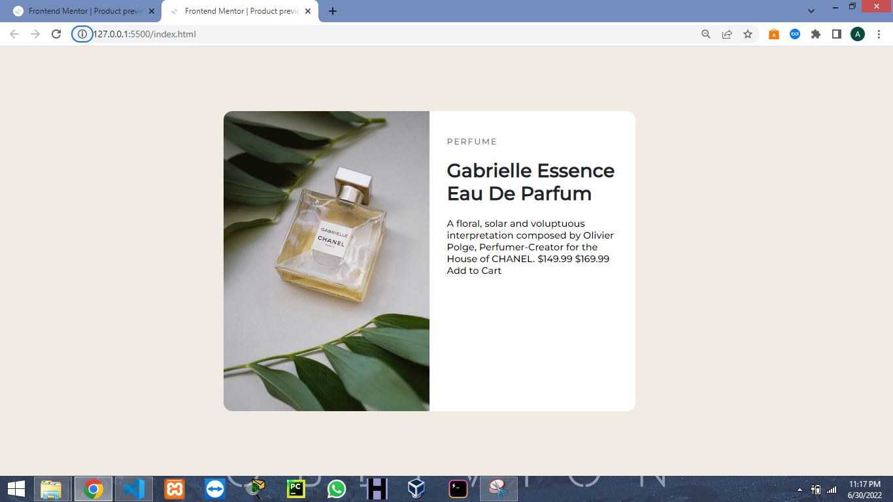
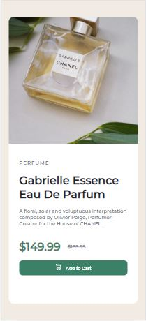
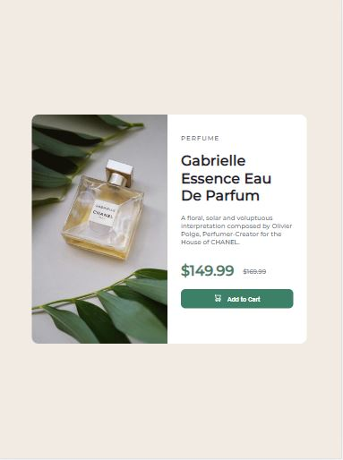

# Frontend Mentor - NFT preview card component solution

This is a solution to the [product-preview-card-component-main](https://www.frontendmentor.io/challenges/product-preview-card-component-main-SbdUL_w0U). Frontend Mentor challenges help you improve your coding skills by building realistic projects. 

## Table of contents

  - [The challenge](#the-challenge)
  - [Screenshot](#screenshot)
  - [Links](#links)
  - [Built with](#built-with)
  - [What I learned](#what-i-learned)
  - [Continued development](#continued-development)
- [Author](#author)

**Note: Delete this note and update the table of contents based on what sections you keep.**

### The challenge

Users should be able to:

- View the optimal layout depending on their device's screen size
- See hover states for interactive elements

### Screenshot

### Links

- Solution URL: (https://github.com/HenryAgu/ProductPreview.git)
- Live Site URL: [Add live site URL here](https://your-live-site-url.com)

## My process

### Built with

- Semantic HTML5 markup
- CSS custom properties
- Media Query

### What I learned

- From this project, I understood practically the use of width and how important and how it made my work easier and faster.
- I also learnt about the active state of not just a link or botton but also an ordinary text.

To see how you can add code snippets, see below:

### Continued development

I will like to explore works that will improve my centralizing skill.

## Author

- Frontend Mentor - [@HenryAgu](https://www.frontendmentor.io/profile/HenryAgu)
- Twitter - [@_henryi](https://www.twitter.com/_henryi)
